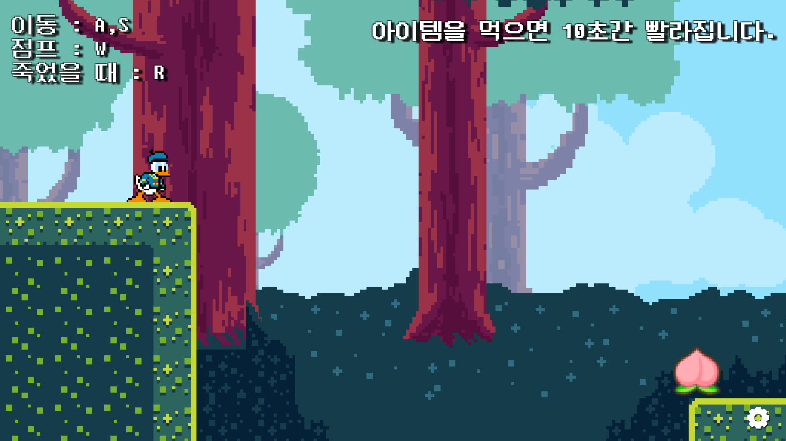
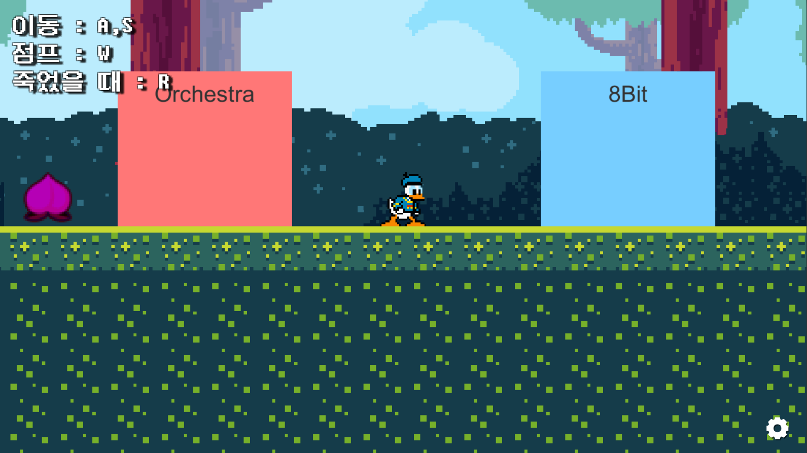
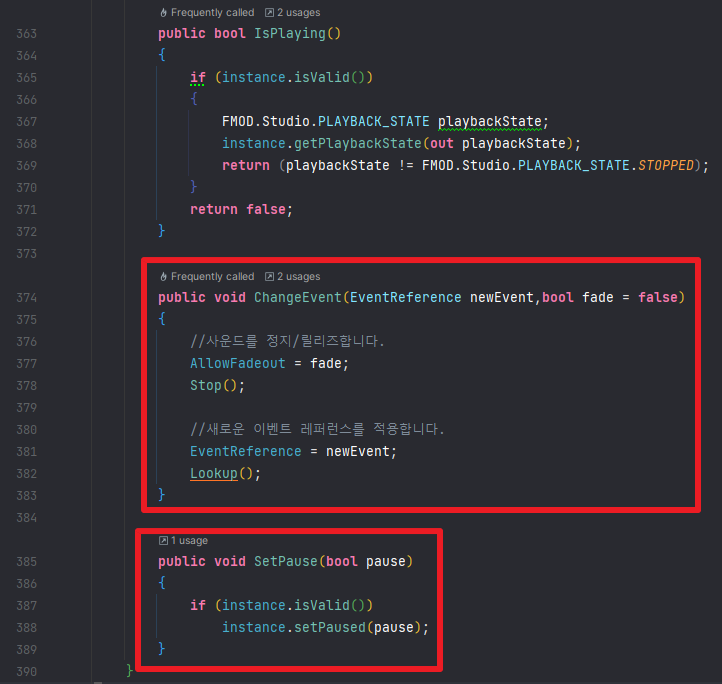

# PlatformExample
유니티 횡스크롤 이동 + FMOD 사운드 미들웨어 사용에 대한 데모입니다.

복숭아를 먹으면 음악의 속도가 빨라지고, 독 복숭아를 먹으면 사운드가 종료됩니다.

오케스트라 영역에 들어가면 BGM이 오케스트라 풍으로 바뀌고, 8Bit영역에 들어가면 8비트 음악으로 자연스레 전환됩니다.

볼륨을 조절할 수 있고, FMOD의 파라미터를 조절하는 Stage를 통해 오케스트라 <--> 8Bit로 전환할 수 있습니다.

Pause를 통해 배경음악을 일시정지 <--> 재생 시킬 수 있습니다.

`Audio Manager`, `GameManager`, `SaveLoadManager`가 각각 구현되어 있습니다.
이는 게임이 시작시 자동으로 생성되도록 구현되어있고, 이는 `Gameplay Ingredient` 에셋을 통해 매니저를 구성했습니다.

FMOD에서 제공하는 StudioEventEmitter는 런타임에서 EventReference를 변경하도록 하는 것을 기본적으로 제공하지 않는다.
그래서 다음과 같이 ChangeEvent()f를 구성해야하며, Pause()기능 또한 별도로 추가해야한다.
